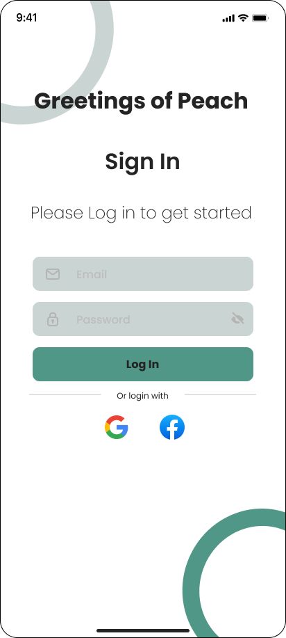
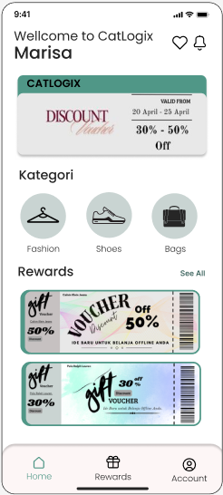
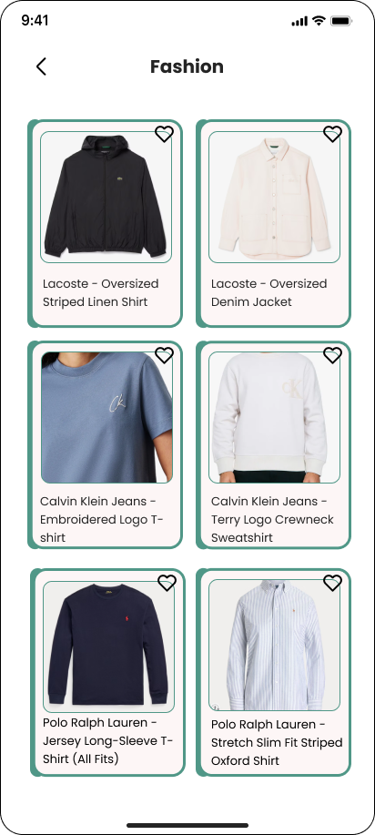
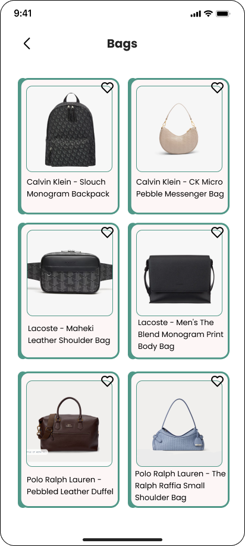
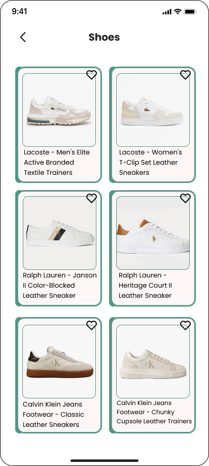
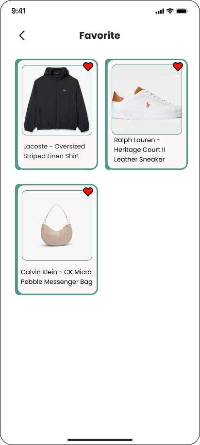
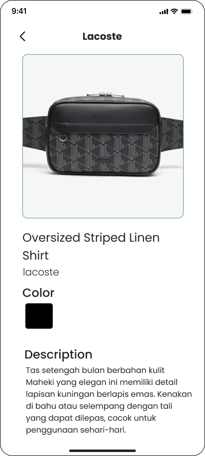
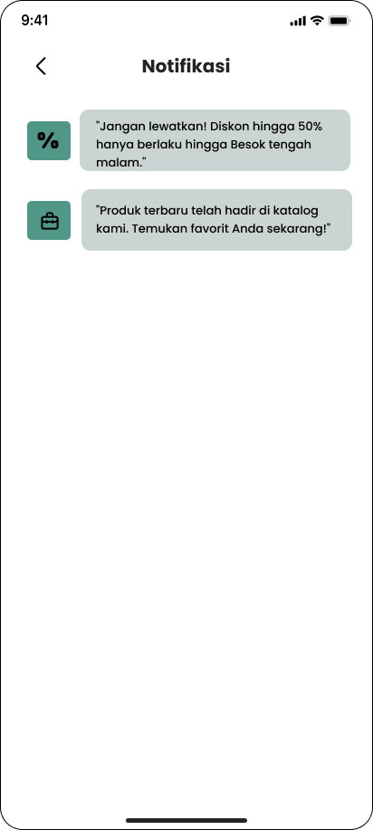
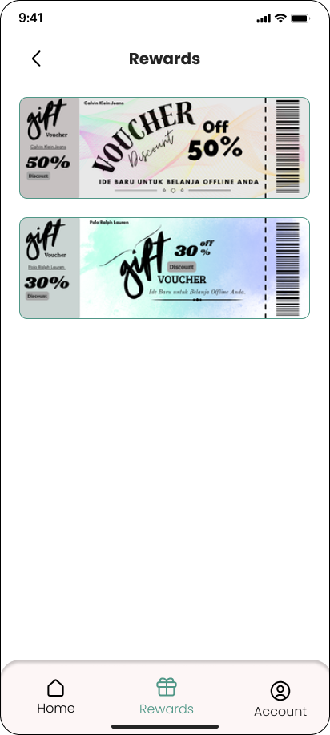
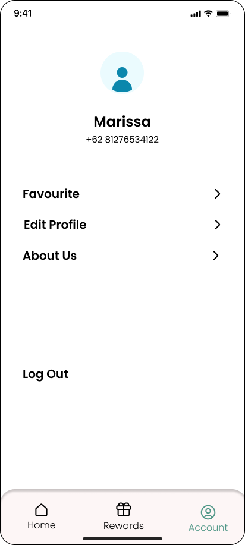

# UTS_PEMROGRAMAN_MOBILE
ini adalah repository untuk kelomopok 13, yang beranggotakan
Aaqilah Aathirah Sutisna, Rasya Fakhri Akbar, Dendi Permana

## Profil Anggota
| Nama Anggota | NIM |
| -------- | --- |
| **Aaqilah Aatirah Sutisna** | 312310621 |
| **Rasya Fakhri Akbar** | 312310626 |
| **Dendi Permana** | 312310694 |

### Link trello

https://trello.com/b/GLnxTDA2/pemrograman-mobile-2

#### UI/UX

pada halaman ini users dapat melakukan login

ini adalah tampilan utama pada aplikasi Catlogix

setelah users meng-click salah satu menu pada home dashboard tampilan akan langsung dialihkan se halaman ini

saat user meng-click tanda hati maka barang akan langsung terkirim kedalam halaman ini

saat user tertarik pada barang dan meng-click maka akan langsung ditampilkan deskripsi barang tersebut

halaman notifikasi ditujukan agar users dapat pemberitahuan tentang barang dan lain lain

ini adalah halaman yang bertujuan untuk memberikan users sebuah hadiah berupa dicount dan lain lain

users dapat melihat profilnya pada halaman ini